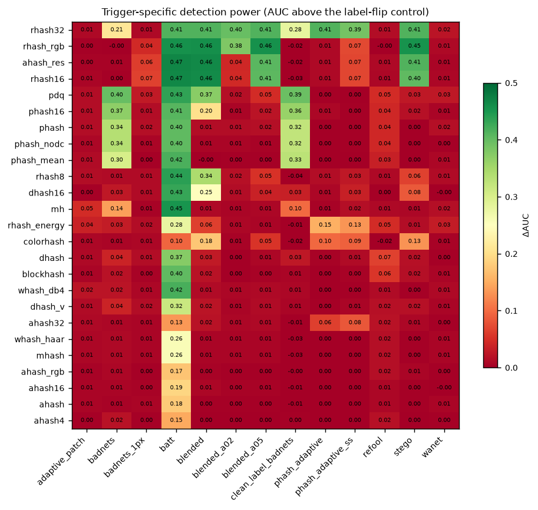

# Perceptual Hash Functions as a Defense Against Data Poisoning

Implementation and evaluation of the master-thesis proposal *"Novel Defense
Against Data Poisoning: Perceptual Hash Functions"* (COSIC, KU Leuven), which
asks two questions:

1. **Are perceptual hash functions an effective defense against state-of-the-art
   poisoning attacks?**
2. **Are they suitable for use in multi-party computation (MPC)?**

Both are answered quantitatively here: 26 perceptual hashes × 7 detection
statistics × 13 poisoning attacks (attacks generated with
[BackdoorBox](https://github.com/THUYimingLi/BackdoorBox)), plus an instrumented
secret-sharing cost model that prices every hash and detector under 3-party
replicated and 2-party SPDZ-style protocols.

---

## Краткое резюме (RU)

**Что сделано.** Реализована и измерена защита от отравления обучающих данных на
базе перцептуальных хешей — как того требует тезис. Три части:

* **Хеши** (`phash_defense/hashes.py`) — 26 функций: классические aHash, mHash,
  dHash, pHash, wHash (Haar/db4), blockhash, PDQ, Marr–Hildreth, colorhash — все
  приведены к нормальной форме `binarise(L·x)` с *публичным линейным* `L`; плюс
  предложенное здесь семейство **residual-хешей**, которое смотрит именно на ту
  высокочастотную компоненту, которую перцептуальный хеш по определению
  выбрасывает.
* **Детекторы** (`phash_defense/detectors.py`) — 7 статистик разной
  вычислительной формы: линейный `bit_llr`, EM-смесь, k-NN и radius-поиск по
  Хеммингу, блочные коллизии, спектральная сигнатура в пространстве бит,
  и `hash_stability` (полностью посэмплово, без межсэмпловых обращений).
* **MPC** (`phash_defense/mpc/`) — трассировщик секретных долей: каждый хеш
  выполняется в fixed-point над `Z_2^64`, результат сверяется побитово с
  plaintext-версией, а все примитивы, требующие коммуникации, точно
  подсчитываются и оцениваются по стоимости для 3PC/2PC на LAN/WAN.

**Главные выводы.**

*Эффективность (вопрос 1 тезиса).*

* **Классические перцептуальные хеши для этой задачи почти бесполезны.**
  aHash/dHash/wHash/blockhash дают прирост AUC ≤ 0.05 над контролем почти на
  всех атаках. Это не баг реализации: они *по построению* выбрасывают ровно тот
  сигнал, в котором живёт триггер (Proposition 4 в `docs/02_theory.md`).
  Исключение — DCT-хеши (pHash/PDQ), которые видят фиксированный патч
  (ΔAUC ≈ +0.4 на BadNets).
* Предложенное здесь **residual-семейство** («перцептуальное дополнение») ловит
  все *sample-agnostic* триггеры, включая невидимые: blended при α = 0.02,
  стеганографический, поворот, и адаптивный «шахматный». Удаляется 64–100%
  отравленных примеров ценой 1–14% чистых.
* Все *sample-specific* триггеры (WaNet, Refool, мульти-паттерновая адаптивная
  атака Qi et al.) не детектируются — и это доказуемо, а не эмпирически.
* **Главный практический вывод:** важна не доля удалённого яда, а сколько его
  осталось. 64% удаления на BadNets (осталось 906 примеров) не меняет ASR вообще
  (0.96 → 0.95), тогда как 96% (осталось 102) роняет ASR с 1.00 до 0.15, а
  99.96% (остался 1) — до 0.00. Защиту надо настраивать на почти полную полноту,
  а не на баланс precision/recall.
* Обязательный контроль: у грязно-лейбловых атак часть «детекции» — это просто
  обнаружение шума в метках. Контроль «только смена меток, без триггера» сам по
  себе даёт AUC до 0.77, и все цифры считаются относительно него.

*Пригодность для MPC (вопрос 2 тезиса).*

* Вся арифметика перцептуального хеша (DCT, вейвлет, blur, пулинг) в MPC
  **бесплатна**; платится только за бинаризацию. Замена медианного порога на
  средний делает pHash **в 38 раз дешевле** при той же длине хеша.
* Медиану надо брать через **ранги**, а не через сеть сортировки: 10 раундов
  вместо 4350 (в 435 раз меньше по глубине).
* Очистка 50 000 изображений CIFAR-10 стоит **29 ГБ и 78 с на LAN** — в 2·10⁹
  раз дешевле защит, которым нужна обученная модель (Spectral Signatures), и в
  326 раз дешевле, чем k-NN по пикселям.
* Линейная статистика `bit_llr` проигрывает попарной k-NN всего 0.014 AUC, но
  стоит в 13 раз меньше — то есть опасение из тезиса («защиты полагаются на
  k-NN и кластеризацию, плохо подходящие для MPC») снимается.

Полные результаты и таблицы — в `docs/04_results.md` и `results/tables.md`.

---

## Repository layout

```
phash_defense/            the library
├── hashes.py             26 perceptual hashes in the binarise(L·x) normal form
├── detectors.py          7 poison-detection statistics + threshold rules
├── attacks.py            13 poisoned-dataset builders (BackdoorBox + this work)
├── data.py               CIFAR-10 loading / materialisation / caching
├── metrics.py            AUC, TPR@FPR, elimination and sacrifice rates
├── train.py              ResNet-18 end-to-end evaluation (BA / ASR)
└── mpc/
    ├── tracer.py         instrumented fixed-point secret-sharing type
    ├── protocols.py      3PC-replicated and 2PC-SPDZ cost models, LAN/WAN
    ├── circuits.py       MPC formulation of every hash (+ correctness gate)
    └── costs.py          analytic cost of the dataset-level detectors/baselines

integration/              everything that plugs into BackdoorBox
├── setup.sh              clones the upstream toolbox and installs the below
├── compat-fixes.patch    4 fixes for modern PyTorch / NumPy (see the end of this file)
├── core/defenses/PerceptualHash.py     the defense, in BackdoorBox house style
└── tests/test_PerceptualHash.py        usage example

scripts/
├── run_validation.py     hashes vs the imagehash reference + structural claims
├── run_detection.py      the attacks x hashes x detectors grid
├── run_purification.py   elimination / sacrifice at the operating point
├── run_mpc_bench.py      MPC correctness gate + cost tables
├── run_end2end.py        train, purify, retrain -> BA / ASR
├── make_tables.py        results/tables.md
└── make_figures.py       results/figures/*.png

docs/                     the report (literature, theory, MPC, results)
results/                  csv / figures produced by the scripts
tests/                    unit tests (pytest)
```

## Setup

```bash
uv venv --python 3.12 .venv
uv pip install --python .venv/bin/python -r requirements.txt
bash integration/setup.sh          # fetch BackdoorBox, patch it, install the defense
```

BackdoorBox is a third-party GPL project and is **not vendored here**:
`integration/setup.sh` clones it at the commit the experiments were run against
(`af3afd1`), applies the compatibility patch and copies in the defense.

CIFAR-10 is downloaded automatically into `data/` on first use (170 MB).
The poisoned datasets are cached under `results/datasets/` (~4 GB) and are
regenerated on demand; neither directory is tracked by git.

## Reproduce

```bash
.venv/bin/python -m pytest tests/ -q            # 50 unit tests
.venv/bin/python scripts/run_validation.py      # hashes vs the imagehash reference
.venv/bin/python scripts/run_mpc_bench.py       # MPC correctness gate + cost tables
.venv/bin/python scripts/run_detection.py       # the full detection grid (~35 min)
.venv/bin/python scripts/run_detection.py --attacks label_flip_only \
        --out results/detection_control.csv     # the label-flip control
.venv/bin/python scripts/run_detection.py --attacks badnets blended \
        clean_label_badnets phash_adaptive --rates 0.005 0.01 0.02 0.10 \
        --out results/detection_rates.csv       # poison-rate sweep
.venv/bin/python scripts/run_purification.py    # elimination / sacrifice operating points
.venv/bin/python scripts/run_end2end.py         # train / purify / retrain (BA, ASR)
.venv/bin/python scripts/make_tables.py         # results/tables.md
.venv/bin/python scripts/make_figures.py        # results/figures/*.png
```

`scripts/run_detection.py --quick` runs a reduced grid in a few minutes.

## Results at a glance

| | |
|---|---|
| best hash | `rhash32` (proposed residual hash, 1024 bits) — mean ΔAUC 0.26 over 13 attacks |
| best classical hash | `pdq` / `phash16` — ΔAUC 0.14, and only against patch triggers |
| best detector | `bit_em` 0.90 mean AUC; `bit_llr` 0.89 at 1/13 of the MPC cost |
| detected | BadNets, blended (α = 0.10 / 0.05 / 0.02), clean-label BadNets, BATT, steganographic, both adaptive attacks |
| not detected | WaNet, Refool, multi-pattern adaptive (Qi et al.), 1-pixel BadNets |
| purification | 64–100 % of the poison removed at 1–14 % clean-data loss |
| end-to-end (ResNet-18) | ASR 1.00 → **0.00** (adaptive attack), 1.00 → **0.15** (blended), 0.96 → 0.95 (BadNets: 64 % removal is not enough), benign accuracy preserved within 1.2 points |
| MPC cost | 29 GB / 78 s (LAN) for 50 000 images — 2·10⁹× below a model-based defense |



## Using the defense

```python
import core                                    # BackdoorBox

# the recommended two-stage sieve
defense = core.PerceptualHash(stages=core.PerceptualHash.DEFAULT_STAGES)
purified = defense.get_purified_dataset(poisoned_train_dataset)

# or a single statistic, e.g. the MPC-cheapest one
defense = core.PerceptualHash(hash_names=['rhash32'], detector='bit_llr',
                              rule='cluster')
```

## Upstream fixes applied to BackdoorBox

`integration/compat-fixes.patch` contains four groups of fixes needed to run the
toolbox on modern PyTorch / NumPy, plus the registration of the new defense.
They are unrelated to the defense itself:

* `core/attacks/TUAP.py` — `torch.autograd.gradcheck.zero_gradients` was removed
  in torch ≥ 1.9; a local fallback is provided.
* `core/attacks/__init__.py` — `BAAT` needs the external `ArtFlow` repository,
  which is not installable from PyPI; its import is now optional.
* `core/attacks/Refool.py` — `np.lib.pad` was removed in NumPy 2.
* `core/attacks/AdaptivePatch.py` — the CIFAR-10 path of the attack was
  unfinished upstream: the dispatcher branch was commented out, the
  `PoisonedCIFAR10` class was a leftover single-pattern copy without the cover
  set, and the trigger returned float tensors that `Image.fromarray` rejects.
  All three are fixed, and the `list.index()` lookups are replaced by dicts.
* `core/models/{vgg,resnet}_curve.py` — `import curves` only worked when
  `core/models` was on `sys.path`; changed to a relative import.
* `core/defenses/__init__.py` — registers the new `PerceptualHash` defense.

## License

GPL-3.0, matching [BackdoorBox](https://github.com/THUYimingLi/BackdoorBox),
which the defense plugs into.

## Documents

| file | content |
|---|---|
| [`docs/01_literature_review.md`](docs/01_literature_review.md) | attacks, defenses, perceptual hashing, MPC for ML, and the gap |
| [`docs/02_theory.md`](docs/02_theory.md) | threat model, the `binarise(L·x)` normal form, trigger-response propositions, detectability bounds, adaptive attacks |
| [`docs/03_mpc_analysis.md`](docs/03_mpc_analysis.md) | protocol cost model, per-hash and per-pipeline costs, design rules |
| [`docs/04_results.md`](docs/04_results.md) | all measurements, including the negative ones |
